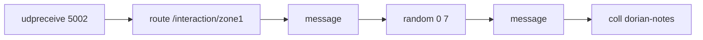
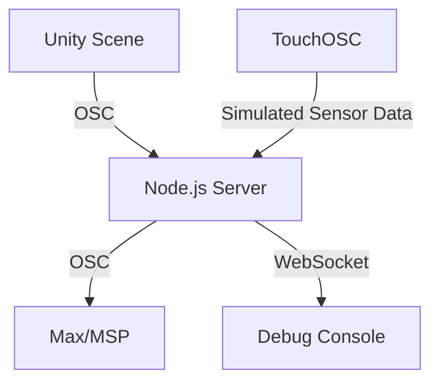

# Interactive Sculpture Simulation in Unity (for MDTA)

## Overview

The **Interactive Sculpture Simulation** is a Unity-based project designed to previsualize and test interactions with a sonic sculpture—a touch tapestry that tells a story through sound as users interact with it. This project emulates sensor data (touch and GSR) to trigger visual and auditory feedback, facilitating iterative testing and refinement before deploying the physical sculpture.

For more detailed information about the MDTA project, please visit the [MDTA Project Approach Plan](https://drexel-garden.vercel.app/drexel-research/mdta/design-and-development/mdta-project-approach-plan/).

---

## Objectives

- **Simulate the Touch Tapestry**: Create a virtual representation of the tapestry with interactive sections.
- **Facilitate OSC Communication**: Use a custom Node.js server with WebSocket and OSC support.
- **Generate Soundscapes**: Leverage Max/MSP patches for dynamic, probabilistic generative music.
- **User Interaction**: Modify Unity’s character controller to navigate and interact with the tapestry.
- **Efficient Asset Integration**: Use Houdini to process and import gallery assets into Unity.

---

## Technical Stack

- **Unity 6 (6000.0.30f1)**: 3D simulation environment with `extOSC` plugin for OSC communication.
- **Houdini (20.5.410)**: Geometry processing and custom attribute generation for Unity materials.
- **Node.js**: Custom OSC server with support for WebSocket communication.
- **Max 9 (Max/MSP)**: Probabilistic generative music in D Dorian key.
- **TouchOSC**: Test data generation via Lua scripts for GSR and MPR121 sensors.
- **C# Scripting**: Custom Unity scripts for interaction and OSC handling.

---

## Implementation Details

### 1. Custom Node.js OSC Server

The Node.js server manages OSC communication between Unity, Max/MSP, and TouchOSC. It supports message forwarding, logging, and basic WebSocket functionality (not fully tested).

#### Example Code Snippet (Node.js Server)

```javascript
const osc = require('osc');
const udpPort = new osc.UDPPort({
  localAddress: '0.0.0.0',
  localPort: 5000,
  metadata: true,
});

udpPort.on('message', (oscMessage) => {
  console.log(`Received OSC message:`, oscMessage);
});

udpPort.open();
```

---

### 2. Houdini Asset Pipeline

Houdini was used to process and convert the Perelstein Gallery space geometry from Sketchfab to FBX. A digital representation of the tapestry was created with custom geometry attributes to automatically generate Unity materials. The asset was imported into Unity as an HDA via the Houdini Engine for Unity.

#### Example Attribute Configuration (Houdini)

```vex
if (inprimgroup(0, "seams", @primnum)) {
    s@unity_material = "Assets/Materials/mat_Seams.mat";
} else if (inprimgroup(0, "Zone1", @primnum)) {
    s@unity_material = "Assets/Materials/mat_Zone1.mat";
```

---

### 3. Unity Integration

The Unity project implements a modified first-person character controller, OSC communication via extOSC, and interaction logic for the digital tapestry.

#### Key Features

- **Interactive Zones**: Triggered by a virtual touchpoint linked to the camera view.
- **OSC Messaging**: Handles real-time data exchange between Unity, Node.js, and Max/MSP.

#### Example Code Snippet (ZoneOSCTransmitter)

```csharp
public class ZoneOSCTransmitter : MonoBehaviour
{
    public OSCTransmitter transmitter;
    public string oscAddress = "/interaction";

    private void OnTriggerEnter(Collider other)
    {
        var message = new OSCMessage(oscAddress);
        message.AddValue(OSCValue.Int(1));
        transmitter.Send(message);
    }
}
```

---

### 4. Max/MSP Sound Engine

A vertical mix was implemented in Max/MSP to generate a probabilistic soundscape in the D Dorian key. The patch receives OSC messages from Unity to control sound generation dynamically.

#### Key Layers

- **Chords**: Weighted probability for substitutions and inversions.
- **Melody**: Randomized note generation.
- **Ambience**: Looping background tracks.

#### Example Max/MSP Setup



```max
[udpreceive 5002]
| [route /interaction/zone1]
| [message] -> [random 0 7] -> [message (index note pairs) -> [coll dorian-notes]]
```

---

### 5. TouchOSC Data Simulation

TouchOSC was used to emulate sensor inputs for testing purposes when the sensors are not immediately available. A Lua script generates random GSR and touch sensor data, which are sent via OSC to the Node.js server.

#### Example Lua Code

```lua
function sendRandomNumber(buttonID)
    local value = math.random(40, 60)
    sendOSC("/test/data/" .. buttonID, value)
end
```

---

## Payload Examples

### OSC Message (Unity to Max/MSP)

```plaintext
Address: /interaction/zone1
Arguments: [1]
```

### OSC Message (TouchOSC to Node.js)

```plaintext
Address: /test/data/gsrVoltage
Arguments: [2.35]
```

---

## Some Challenges and Solutions

### 1. Synchronization + Logging Issues

**Challenge**: Ensuring real-time data consistency and over-flooding of the serve console (Windows PowerShell).
**Solution**: Implemented caching and filtering logic in Node.js to reduce redundant messages.

### 2. Data Simulation Accuracy

**Challenge**: Simulating realistic, continuous sensor data in real-time.
**Solution**: Used TouchOSC + Lua scripting functionality and predefined data patterns (random generation from range) to send to server.

---

## Repository Structure Overview

### `/unity`

- C# scripts for Unity interaction and OSC communication
- Custom character controller modifications
- Zone trigger implementations

### `/node`

- Node.js OSC server implementation
- WebSocket communication handlers
- Message routing and logging utilities

### `/max`

- Max/MSP patches for generative sound
- OSC message receivers
- Probability-based music generation

### `/gen`

- Lua scripts for sensor data simulation
- TouchOSC layout configurations
- Test data generation utilities

---

## Custom Features vs Engine Features

### Built from Scratch

- Custom Node.js OSC server for multi-directional communication
- Touch interaction system with zone-based triggers
- GSR data simulation and processing pipeline
- Probabilistic sound generation system in Max/MSP

### Leveraged from Unity

- Character Controller (modified for our needs)
- Physics and collision detection system
- Material system for zone visualization
- Camera system

## Data Exchange Format

### OSC Message Structure (Eaxmple from Zone)

```plaintext
/source/type/action {
    value: float,
    zone: string + [int - zone #]
}
```

Example flows:

1. Touch Detection: `/interaction/Zone1 {"value": 1, "Zone1"}`
2. GSR Voltage Data: `/sensor/gsr/vltage {"type":, float", value": 2.35}`

## System Architecture (Simplified)



---

## Video Walkthrough

Below you can watch a brief video walkthrough of the project demonstrates a the tools and pipeline developed for simulating an interactive sonic sculpture. By leveraging Unity, Houdini, Node.js, and Max/MSP, it integrates visual and auditory components to prototype and refine user interactions efficiently.

[Watch the video walkthrough](https://1drv.ms/v/s!AqQzGx8l4o2wk-0XzAcw-lof8cSmag)

---
---
